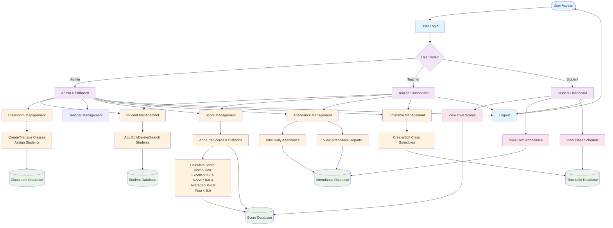
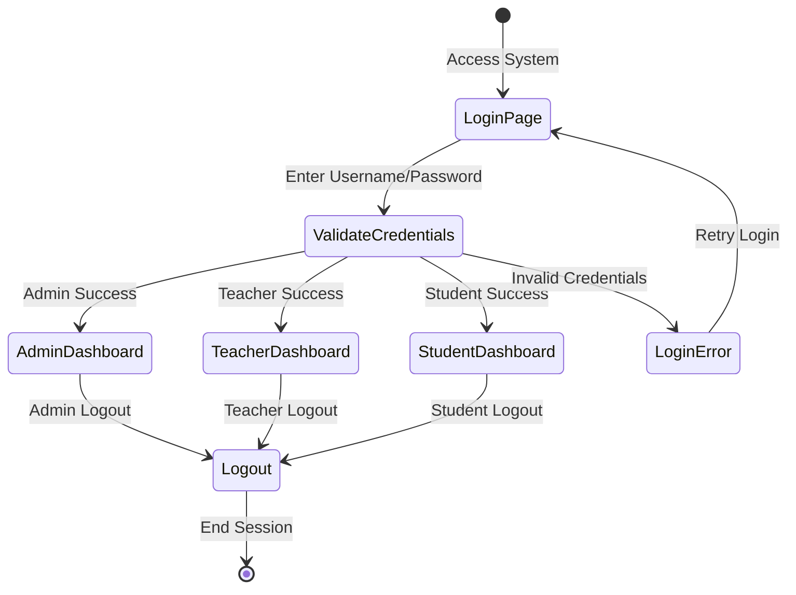
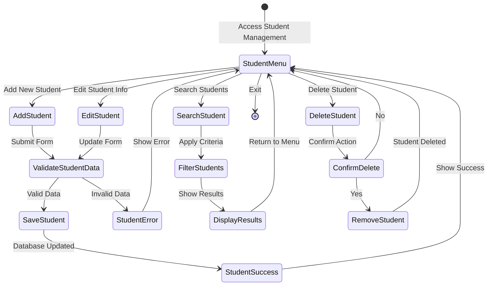
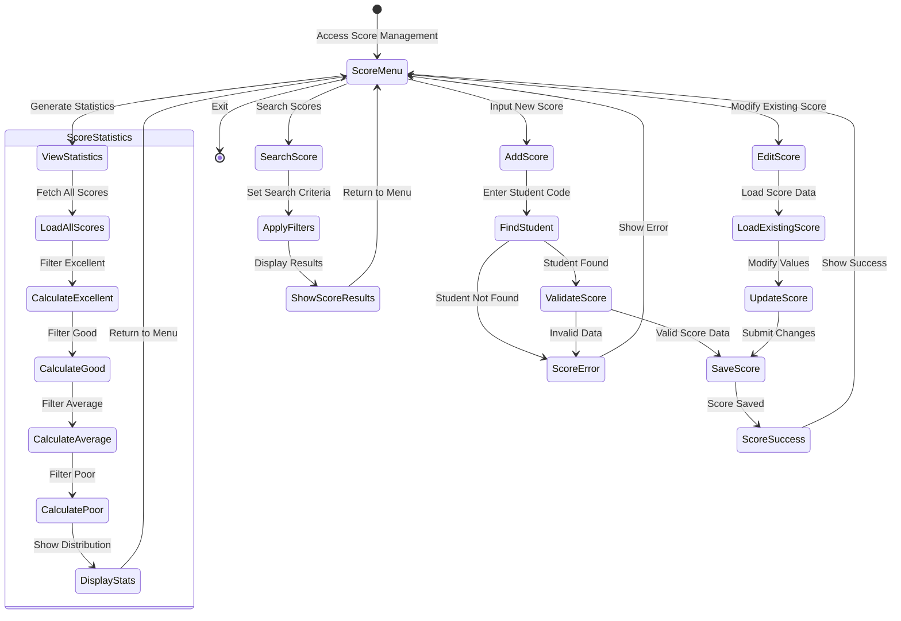
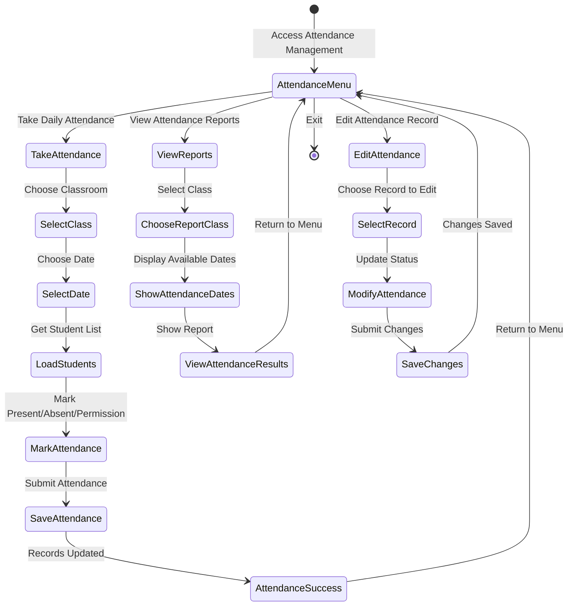
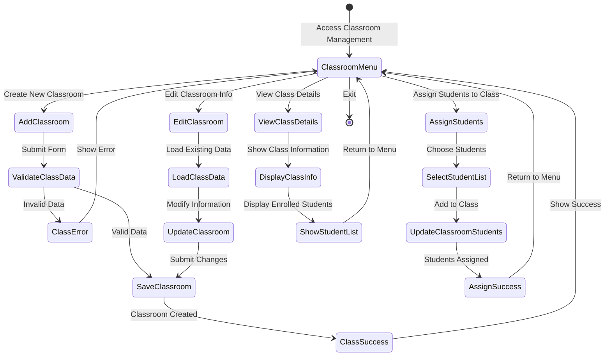
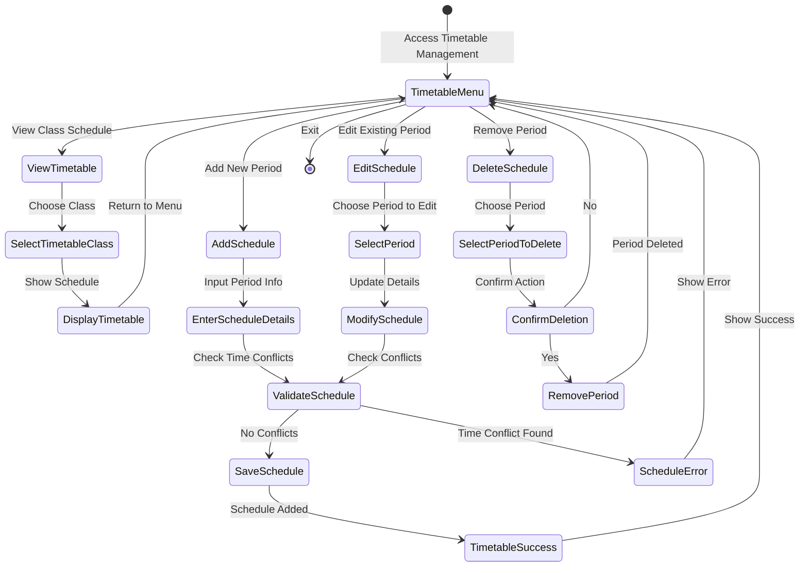
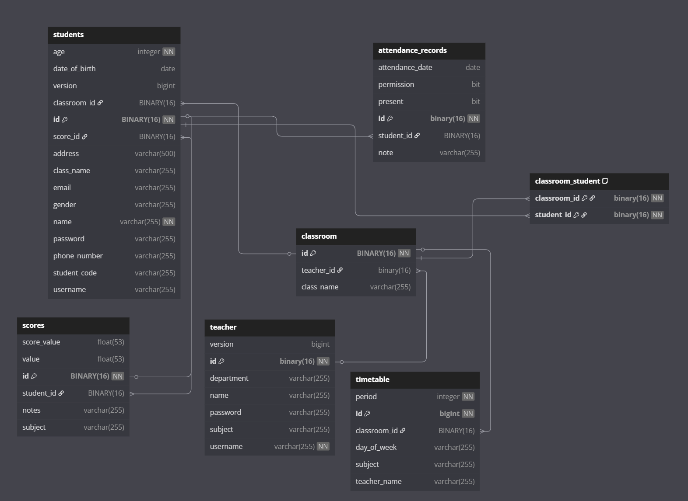

# OOP_N01_K-3_2025_K17_Nhom7 — Dự án Quản Lý Lớp Học

---

## 1. Giới thiệu

**Quản Lý Lớp Học** là một hệ thống web ứng dụng được phát triển bằng Java Spring Boot, phục vụ cho việc quản lý toàn diện các hoạt động của một lớp học hiện đại: quản lý giáo viên, học sinh, lớp học, điểm số, điểm danh, thời khóa biểu, phân quyền, báo cáo và nhiều chức năng mở rộng khác. Hệ thống hướng tới việc số hóa công tác quản lý, giúp giáo viên, học sinh và nhà trường thao tác, tra cứu, cập nhật thông tin một cách nhanh chóng, chính xác và bảo mật.

---

## 2. Thành viên nhóm

| Họ tên              | MSSV      | Vai trò/Nhiệm vụ chính                                                 |
|---------------------|-----------|------------------------------------------------------------------------|
| Chu Thành Tân (*)   | 23010165  | Giao diện đăng nhập đăng ký, Quản lý Database, Framework, Template, Quản lý giáo viên, Phân quyền chức năng|
| Nguyễn Văn Hải  | 23017261  | Quản lý học sinh, quản lý điểm danh, quản lý điểm số, test case kiểm thử | 
| Nguyễn Đức Lâm      | 22010267  | Quản lý lớp học, quản lý thời khoá biểu, báo cáo                       |
| GVHD: Nguyễn Lệ Thu |           | Hướng dẫn, phản biện                                                   | 


---

## 3. Công nghệ sử dụng

- **Ngôn ngữ:** Java 17
- **Framework:** Spring Boot, Spring MVC, Spring Data JPA
- **Cơ sở dữ liệu:** Cloud Database Aiven + MySQL để quản lý CSDL (có thể chuyển sang H2 cho test nhanh) 
- **Template Engine:** Thymeleaf
- **Quản lý phụ thuộc:** Maven
- **Kiểm thử:** JUnit 4/5
- **Quản lý phiên bản:** Git, GitHub
- **Frontend:** HTML, CSS, Bootstrap, JavaScript
- **Khác:** Spring Security (nếu có phân quyền), các thư viện hỗ trợ báo cáo (nếu có)

---

## 4. Chức năng chính đã xây dựng

- Đăng nhập/đăng xuất, phân quyền người dùng (giáo viên, học sinh, admin)
- Quản trị viên (Admin): toàn bộ chức năng của Teacher, và có quyền Thêm/sửa/xoá thông tin của các giáo viên
- Quản lý giáo viên: thêm, sửa, xóa, tìm kiếm, phân công chủ nhiệm, phân quyền được xem thông tin các giáo viên, không được chỉnh sửa thông tin giáo viên khác
- Quản lý học sinh: thêm, sửa, xóa, tìm kiếm thông tin học sinh
- Quản lý lớp học: thêm, sửa, xóa, xem danh sách học sinh, giáo viên chủ nhiệm
- Quản lý điểm số: nhập điểm, sửa điểm, xem điểm theo học sinh/lớp/môn
- Quản lý điểm danh: điểm danh theo buổi, xem báo cáo chuyên cần
- Quản lý thời khóa biểu: tạo, sửa, xem lịch học theo lớp/học sinh/giáo viên.
- Quyền học sinh: Học sinh có quyền xem thời khoá biểu, xem điểm số của mình, xem báo cáo điểm danh.
- Giao diện web thân thiện, responsive, đa nền tảng
- Kết nối, lưu trữ dữ liệu trên MySQL
- Kiểm thử tự động với JUnit

---

## 5. Cấu trúc thư mục Project

```
OOP_N01_K-3_2025_K17_Nhom7/
├── .gitattributes
├── .gitignore
├── mvnw
├── mvnw.cmd
├── pom.xml
├── README.md
├── tree.txt
├── images/
├── src/
│   ├── main/
│   │   ├── java/
│   │   │   └── com/
│   │   │       └── oopgroup7/
│   │   │           └── quanlylophoc/
│   │   │               ├── Main.java
│   │   │               ├── Controller/
│   │   │               │   ├── AttendanceController.java
│   │   │               │   ├── ClassroomController.java
│   │   │               │   ├── HomeController.java
│   │   │               │   ├── LoginController.java
│   │   │               │   ├── RegController.java
│   │   │               │   ├── ScoreController.java
│   │   │               │   ├── StudentController.java
│   │   │               │   ├── TeacherController.java
│   │   │               │   └── TimetableController.java
│   │   │               ├── Model/
│   │   │               │   ├── AttendanceRecord.java
│   │   │               │   ├── Classroom.java
│   │   │               │   ├── ClassroomStudent.java
│   │   │               │   ├── ClassroomStudentId.java
│   │   │               │   ├── Score.java
│   │   │               │   ├── Student.java
│   │   │               │   ├── Teacher.java
│   │   │               │   └── Timetable.java
│   │   │               ├── Repository/
│   │   │               │   ├── AttendanceRepository.java
│   │   │               │   ├── ClassroomRepository.java
│   │   │               │   ├── ClassroomStudentRepository.java
│   │   │               │   ├── ScoreRepository.java
│   │   │               │   ├── StudentRepository.java
│   │   │               │   ├── TeacherRepository.java
│   │   │               │   └── TimetableRepository.java
│   │   │               └── Service/
│   │   │                   ├── AttendanceService.java
│   │   │                   ├── ClassManager.java
│   │   │                   ├── ClassroomService.java
│   │   │                   ├── ScoreService.java
│   │   │                   ├── StudentService.java
│   │   │                   ├── TeacherService.java
│   │   │                   ├── TimetableService.java
│   │   │                   └── TimetableServiceImpl.java
│   │   └── resources/
│   │       ├── application.properties
│   │       ├── static/
│   │       │   └── (ảnh, CSS, JS)
│   │       └── templates/
│   │           ├── index.html
│   │           ├── admin/
│   │           │   └── index.html
│   │           ├── attendance/
│   │           │   ├── dates.html
│   │           │   ├── edit.html
│   │           │   ├── form.html
│   │           │   ├── index-student.html
│   │           │   ├── index.html
│   │           │   ├── report.html
│   │           │   └── result.html
│   │           ├── classroom/
│   │           │   ├── form.html
│   │           │   ├── index.html
│   │           │   └── student.html
│   │           ├── dashboard/
│   │           │   ├── student.html
│   │           │   └── teacher.html
│   │           ├── login/
│   │           │   └── index.html
│   │           ├── register/
│   │           │   ├── index.html
│   │           │   ├── student-form.html
│   │           │   └── teacher-form.html
│   │           ├── score/
│   │           │   ├── edit.html
│   │           │   ├── form.html
│   │           │   ├── index-student.html
│   │           │   ├── index.html
│   │           │   └── list.html
│   │           ├── student/
│   │           │   ├── form.html
│   │           │   └── index.html
│   │           ├── teacher/
│   │           │   ├── details.html
│   │           │   ├── form.html
│   │           │   └── index.html
│   │           └── timetable/
│   │               ├── class-timetable-student.html
│   │               ├── class-timetable.html
│   │               ├── edit-timetable.html
│   │               └── timetable-class-list.html
│   └── test/
│       ├── java/
│       │   └── com/
│       │       └── oopgroup7/
│       │           └── quanlylophoc/
│       │               ├── TestAttendanceRecord.java
│       │               ├── TestClassroom.java
│       │               ├── TestScore.java
│       │               ├── TestSequence.java
│       │               ├── TestStudent.java
│       │               ├── TestTeacher.java
│       │               └── TimetableValidationTest.java
│       └── resources/
│           └── application-test.properties
```

---

## 6. Mô tả chi tiết các đối tượng và chức năng

### 6.1. Quản trị viên (Admin)
- **Thuộc tính:** Thuộc tính: id, username, password, role (admin)

- **Chức năng:** Có tất cả các chức năng của Teacher, tuy nhiên có quyền Thêm/Sửa/Xoá thông tin của tất cả các giáo viên, Dashboard quản trị với thống kê số lượng học sinh, giáo viên, lớp học; Quản lý toàn bộ thông tin giáo viên (thêm/sửa/xóa); Có toàn quyền truy cập vào tất cả chức năng của hệ thống; Quản lý phân quyền người dùng
### 6.2. Giáo viên (Teacher)
- **Thuộc tính:** id, name, subject (môn dạy), department (khoa/bộ môn), username, các lớp chủ nhiệm
- **Chức năng:** Quản lý thông tin cá nhân (chỉ được sửa thông tin của chính mình); Tìm kiếm thông tin giáo viên theo tên/khoa/môn học; Quản lý học sinh: thêm, sửa, xóa, tìm kiếm học sinh; Quản lý điểm số: nhập điểm, sửa điểm, xem điểm theo học sinh/lớp/môn; Điểm danh học sinh theo buổi học, quản lý báo cáo chuyên cần; Xem và quản lý thời khóa biểu; Xem danh sách lớp chủ nhiệm

### 6.3. Học sinh (Student)
- **Thuộc tính:** id, studentCode (mã học sinh), name, age, gender, dateOfBirth, className, email, phoneNumber, username, lớp (classroomm), điểm (score), điểm danh.
- **Chức năng:** Xem điểm cá nhân theo các môn học, với hiển thị trực quan bằng badge màu theo mức điểm; Xem thông tin điểm danh cá nhân, báo cáo chuyên cần; Xem thời khóa biểu cá nhân và lớp học; Dashboard học sinh với các chức năng truy cập nhanh

### 6.4. Lớp học (Classroom)
- **Thuộc tính:** id, className, teacher (giáo viên chủ nhiệm), students (danh sách học sinh)
- **Chức năng:** Thêm/sửa/xóa/tìm kiếm lớp, hiển thị thông tin lớp: mã lớp, tên lớp, giáo viên chủ nhiệm, sĩ số; Quản lý danh sách học sinh trong lớp (thêm/xóa học sinh); Liên kết với giáo viên chủ nhiệm; Hiển thị danh sách học sinh theo lớp

### 6.5. Điểm số (Score)
- **Thuộc tính:** id, student, subject (môn học), value (giá trị điểm), comment (nhận xét)
- **Chức năng:** Nhập điểm cho từng học sinh theo môn học
Hiển thị điểm với phân loại trực quan bằng màu sắc (>8.5: xanh lá, >7.0: xanh dương, >5.0: vàng, <5.0: đỏ)
Sửa điểm và thêm nhận xét; Xem điểm theo học sinh, lớp, môn học; Chức năng tìm kiếm và lọc điểm; Giao diện khác nhau cho giáo viên (quản lý điểm) và học sinh (xem điểm)
### 6.6. Điểm danh (AttendanceRecord)
- **Thuộc tính:** id, student, date (ngày), status (trạng thái có mặt/vắng)
- **Chức năng:** Điểm danh theo ngày/buổi học
Hiển thị danh sách điểm danh với trạng thái trực quan
Sửa thông tin điểm danh
Báo cáo chuyên cần theo học sinh/lớp
Các chế độ xem: theo ngày, theo học sinh
Giao diện riêng cho giáo viên và học sinh

### 6.7. Thời khóa biểu (Timetable)
- **Thuộc tính:** id, classroom, dayOfWeek (thứ), period (tiết học), subject, teacher, room (phòng học)
- **Chức năng:** Tạo/sửa/xóa thời khóa biểu
Hiển thị thời khóa biểu theo lớp
Xem thời khóa biểu theo học sinh/giáo viên
Giao diện khác nhau cho giáo viên (quản lý) và học sinh (chỉ xem)
Hiển thị đầy đủ thông tin: lớp, ngày, tiết học, môn học, giáo viên, phòng học

---

## 7. Diagram

- Class Diagram


- Behavioural Diagram:




- Activity Diagram:
#1. Diagram đăng nhập:



#2. Diagram quản lý học sinh:


#3. Diagram quản lý điểm:


#4. Diagram quản lý điểm danh:


#5. Diagram Quản lý lớp học

#6. Diagram chức năng thời khoá biểu:


---
## 7. Hướng dẫn sử dụng

### 7.1. Cài đặt & chạy dự án

**Yêu cầu:**
- Java 17+
- Maven 3.6+
- MySQL 8 (hoặc H2 cho test nhanh)

**Các bước:**
```sh
git clone <link-repo>
cd OOP_N01_K-3_2025_K17_Nhom7
mvn clean install
mvn spring-boot:run
```
=> Sau đó truy cập: [http://localhost:8080](http://localhost:8080)

### 7.2. Đăng nhập & phân quyền

- Đăng nhập với tài khoản giáo viên, học sinh hoặc admin.
- Giao diện và chức năng sẽ thay đổi theo quyền truy cập (đăng nhập bằng tài khoản học sinh, giáo viên, admin).

### 7.3. Quản lý dữ liệu

- **Giáo viên:** `/teachers`
- **Học sinh:** `/students`
- **Lớp học:** `/classrooms`
- **Điểm số:** `/scores`
- **Điểm danh:** `/attendance`
- **Thời khóa biểu:** `/timetable`

### 7.4. Quản lý giao diện

- Giao diện chia theo module: giáo viên, học sinh, lớp học, điểm, điểm danh, thời khóa biểu.
- Giao diện responsive, hỗ trợ trên máy tính và thiết bị di động.

---

## 8. API Endpoints 


### 8.1. Xác thực và Đăng ký

* `GET /login` — Hiển thị trang đăng nhập
* `POST /login` — Xử lý đăng nhập (params: username, password, role)
* `GET /logout` — Đăng xuất người dùng hiện tại
* `GET /register` — Hiển thị trang đăng ký
* `GET /register/student` — Form đăng ký học sinh
* `GET /register/teacher` — Form đăng ký giáo viên
* `POST /register/student` — Xử lý đăng ký học sinh mới
* `POST /register/teacher` — Xử lý đăng ký giáo viên mới
* `GET /register/check-username` — Kiểm tra tính khả dụng của username

### 8.2. Dashboard

* `GET /admin/dashboard` — Dashboard cho admin
* `GET /student/dashboard` — Dashboard cho học sinh
* `GET /teacher/dashboard` — Dashboard cho giáo viên

### 8.3. Quản lý giáo viên (Teachers)

* `GET /teachers` — Danh sách tất cả giáo viên
* `GET /teachers/add` — Form thêm giáo viên mới (chỉ Admin)
* `POST /teachers/add` — Xử lý thêm giáo viên (chỉ Admin)
* `GET /teachers/edit/{id}` — Form chỉnh sửa thông tin giáo viên (Admin hoặc chính giáo viên đó)
* `POST /teachers/edit` — Xử lý cập nhật thông tin giáo viên
* `GET /teachers/delete/{id}` — Xóa giáo viên (chỉ Admin)
* `GET /teachers/details/{id}` — Xem chi tiết thông tin giáo viên
* `GET /teachers/search` — Tìm kiếm giáo viên (params: name, department, subject)

### 8.4. Quản lý học sinh (Students)

* `GET /students` — Danh sách tất cả học sinh
* `GET /students/add` — Form thêm học sinh mới
* `POST /students/add` — Xử lý thêm học sinh mới
* `GET /students/edit/{id}` — Form chỉnh sửa thông tin học sinh
* `POST /students/edit` — Xử lý cập nhật thông tin học sinh
* `GET /students/delete/{id}` — Xóa học sinh
* `GET /students/details/{id}` — Xem chi tiết thông tin học sinh
* `GET /students/search` — Tìm kiếm học sinh (params: name, className, studentCode, gender, email)
* `GET /students/search-by-code` — Tìm kiếm nhanh học sinh theo mã sinh viên

### 8.5. Quản lý lớp học (Classrooms)

* `GET /classrooms` — Danh sách tất cả lớp học
* `GET /classrooms/add` — Form thêm lớp học mới
* `POST /classrooms/add` — Xử lý thêm lớp học mới
* `GET /classrooms/{id}` — Xem thông tin chi tiết lớp học
* `GET /classrooms/edit/{id}` — Form chỉnh sửa thông tin lớp học
* `POST /classrooms/edit` — Xử lý cập nhật thông tin lớp học
* `GET /classrooms/delete/{id}` — Xóa lớp học
* `POST /students/api/{studentId}/classrooms/{classroomId}` — Thêm học sinh vào lớp học (AJAX)
* `DELETE /students/api/{studentId}/classrooms/{classroomId}` — Xóa học sinh khỏi lớp học (AJAX)

### 8.6. Quản lý điểm số (Scores)

* `GET /scores` — Danh sách điểm số
* `GET /scores/student` — Xem điểm số cá nhân (dành cho học sinh)
* `GET /scores/form` — Form nhập điểm mới
* `POST /scores/save` — Lưu điểm mới
* `GET /scores/edit/{id}` — Form chỉnh sửa điểm
* `POST /scores/edit` — Xử lý cập nhật điểm
* `GET /scores/delete/{id}` — Xóa điểm
* `GET /scores/search` — Tìm kiếm điểm theo tên học sinh/lớp
* `GET /scores/api/student` — API lấy thông tin học sinh theo mã

### 8.7. Quản lý điểm danh (Attendance)

* `GET /attendance` — Trang chủ điểm danh
* `GET /attendance/form` — Form điểm danh theo lớp và ngày
* `POST /attendance/save` — Xử lý lưu kết quả điểm danh
* `GET /attendance/report` — Báo cáo điểm danh theo lớp
* `GET /attendance/report/{classroomId}` — Danh sách ngày đã điểm danh của lớp
* `GET /attendance/result` — Hiển thị kết quả điểm danh
* `GET /attendance/edit/{id}` — Form sửa điểm danh cá nhân
* `POST /attendance/edit/{id}` — Xử lý cập nhật điểm danh
* `POST /attendance/deleteByClassAndDate` — Xóa điểm danh theo lớp và ngày

### 8.8. Quản lý thời khóa biểu (Timetable)

* `GET /timetable` — Danh sách lớp để xem thời khóa biểu
* `GET /timetable/{classId}` — Xem thời khóa biểu của lớp
* `GET /timetable/{classId}/add` — Form thêm tiết học mới
* `POST /timetable/{classId}/add` — Xử lý thêm tiết học mới
* `GET /timetable/{classId}/edit/{timetableId}` — Form sửa tiết học
* `POST /timetable/{classId}/edit/{timetableId}` — Xử lý cập nhật tiết học
* `GET /timetable/{classId}/delete/{timetableId}` — Xóa tiết học

### 8.9. API Tìm kiếm

* `GET /register/api/search/students` — API tìm kiếm học sinh theo tên
* `GET /register/api/search/teachers` — API tìm kiếm giáo viên theo tên
* `GET /register/api/search/teachers/by-subject` — API tìm kiếm giáo viên theo môn học
* `GET /students/api/classrooms` — API lấy danh sách lớp học


---

## 9. Cấu trúc Database




---

## 10. Kiểm thử

- Các file kiểm thử đơn vị (JUnit) nằm trong `src/test/java/com/oopgroup7/quanlylophoc/`.
- Chạy toàn bộ test bằng lệnh:
```sh
mvn test
```
- Đã kiểm thử các chức năng: thêm/sửa/xóa/tìm kiếm giáo viên, học sinh, lớp học, điểm số, điểm danh, thời khóa biểu.

---

## 11. Tính năng nâng cao (có thể phát triển thêm)

- Thống kê học lực, chuyên cần
- Xuất báo cáo PDF/Excel
- Gửi thông báo qua email
- Lịch sử chỉnh sửa dữ liệu
- Tích hợp API SMS/email cho thông báo
- Cải tiến quyền admin, nhiều chức năng độc quyền hơn
---


## 12. Bản quyền

Dự án thuộc sở hữu của nhóm 7 - OOP K17, năm học 2024-2025.  
Chỉ sử dụng cho mục đích học tập và nghiên cứu.

---
